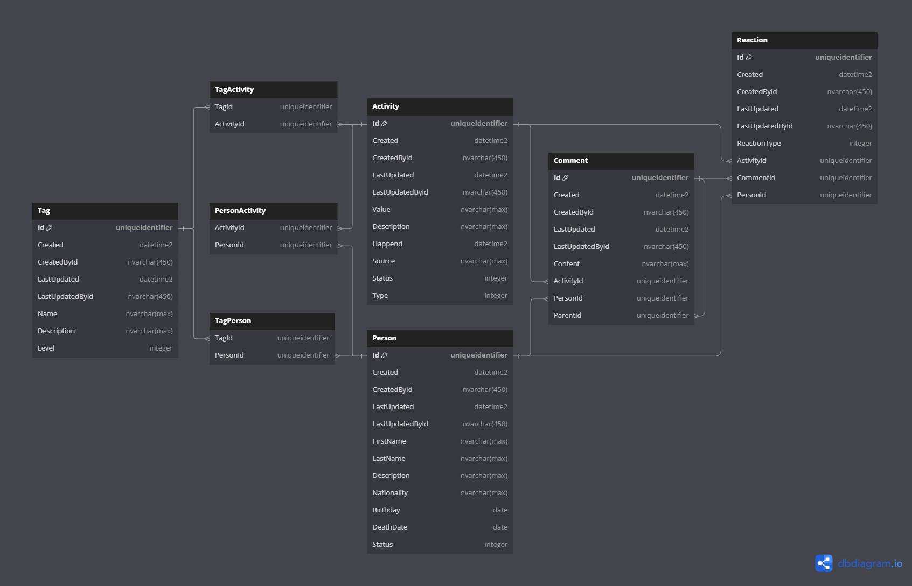

# **RespectCounter (Work in Progress)**

**RespectCounter** is a .NET + React application that allows users to express their opinion on various public figures, their quotes and actions.

---

## **Features**
- Users can browse a catalog of public figures, activities, quotes and comments.
- Users can filter quotes, activities and public figures using tags.
- Users can sign up and log in using their accounts.
- Logged-in users can:
    - Propose new public figures.
    - Add quotes and activities and link them to existing public figures.
    - Comment on and react to public figures, activities, and other comments.
    <!-- - Report activities, quotes and comments of others. -->
- Admins can:
    - Verify public figures, quotes and activities added by users.
    <!-- - Hide comments and activities. -->

---

## **Technology Stack**
- .NET 8
- ASP.NET Core Web API
- ASP.NET Core Identity
- Entity Framework Core
- MediatR 12.4.1
- MS SQL Server
- React 18.2.0
- React-Bootstrap 2.8.0

---

## **Installation**

Follow these steps to set up the project locally:
1. **Requirements**
    Ensure you have the following installed:
    - [**.NET 8 SDK**](https://dotnet.microsoft.com/download/dotnet/8.0)  
    - [**Node.js (v23.0.0)**](https://nodejs.org/)
    - [**Docker**](https://www.docker.com/)

2. **Clone the repository:**
   ```sh
   git clone https://github.com/SzaroBury/RespectCounter.git
   ```
   
3. **Start the API (manual):**
   ```sh
   dotnet run --project ./RespectCounter.API/
   ```

4. **Start the React app (manual):**
   ```sh
   cd ./RespectCounter.ReactApp/
   npm install    # Restore dependencies
   npm start      # Start the frontend application
   ```

---

## **Running with Docker Compose**

The project includes a `docker-compose.yml` file for easy multi-container setup (API, frontend with Nginx, and database).

### **How to run:**

1. Make sure Docker is running on your machine.
2. From the project root, run:
   ```sh
   docker-compose up --build
   ```
   This will build and start all services:
   - **respectcounter-api**: .NET backend API
   - **respectcounter-reactapp**: React frontend (built with Vite, served by Nginx)
   - **respectcounter-db**: SQL Server database

   The React frontend is served by Nginx, which also proxies API requests to the backend.

3. Access the app in your browser at [http://localhost:8080](http://localhost:8080)

4. To stop and remove containers:
   ```sh
   docker-compose down
   ```

---

## Main entities:
- Person
- Activity
- Comment
- Reaction
- Tag



---

## To-Do List

Planned improvements and features:
- Create a moderation page for verifying public figures and activities
- Add an endpoint for requesting comment replies
- Implement data hiding functionality
- Improve the home page design
- Implement pagination
- Add support for user avatars and images for public figures and activities
- Introduce a reporting system for activities and comments